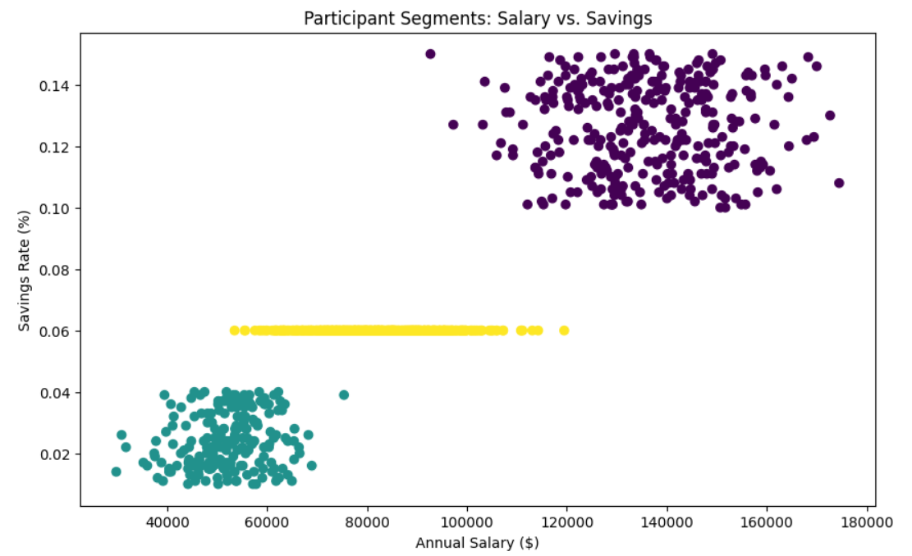

# Retirement-Participant-Behavioral-Analytics-Liquidity-Forecasting

## 📌 Project Overview

This project simulates an end-to-end data engineering and data science lifecycle within the US Retirement Industry.  
The goal was to identify how different participant demographics (personas) react to extreme market volatility and to quantify the resulting liquidity risk for plan recordkeepers.

---

## 🧠 The Business Problem

Retirement plan providers (e.g., Fidelity, Voya) face massive cash-outflow risks when participants take hardship loans during market downturns.  
This project identifies **"at-risk" segments** to help institutions manage cash reserves and deploy targeted financial wellness interventions.

---

## 🛠️ Tech Stack & Architecture

### Data Generation
- Python (NumPy / Pandas)
- Normal distributions used to ensure realistic, non-skewed data

### Database
- PostgreSQL (Relational storage and bulk import)

### The Bridge
- SQLAlchemy
- Psycopg2  
Used to connect the SQL database to the analytical environment

### Analysis Environment
- Jupyter Notebook

#### Libraries Used
- **Scikit-Learn:** K-Means Clustering, StandardScaler  
- **Pandas:** Time Series Resampling and data manipulation  
- **Matplotlib:** Institutional-grade data visualization

---

## 🚀 The Data Pipeline

### Generation
- Created **36 months** of synthetic data for **1,000 participants**
- Explicitly simulated a **−18% market crash at Month 18**

### SQL Integration
- Imported raw CSV files into PostgreSQL tables:
  - `participants`
  - `transactions`

### The Join
- Executed an **INNER JOIN** in SQL to map participant profiles to monthly behavioral data

### Python Bridge
- Used `read_sql` via SQLAlchemy to pull the joined dataset into a Jupyter Notebook for modeling

---

## 📂 Repository Structure

- `data_gen.py`  
  Script to generate the initial CSV files

- `database_setup.sql`  
  SQL scripts for PostgreSQL table creation and joins

- `analysis_master.ipynb`  
  Primary Jupyter Notebook containing clustering and time series analysis

- `assets/`  
  Images of generated plots

  ---

## 📊 Key Findings & Analytics

### 1. Participant Segmentation (Clustering)

Using the **Elbow Method**, three distinct participant personas were identified:

- **Power-Savers:** High-income earners with >10% savings rates  
- **Auto-Pilots:** Mid-income earners following default 6% plan settings  
- **The Fragile Segment:** Lower-income earners with <4% savings rates

---

### 2. Liquidity Stress Test (Time Series)

By converting the timeline into a datetime index and applying the `.resample()` method, a significant behavioral shift was observed:

- **The Spike:** At the Month 18 market crash, loan demand surged by **300%**
- **The Driver:** Segmented analysis showed the **Fragile Segment** accounted for nearly **85% of total cash outflow**, despite representing a smaller share of total plan assets

---

## 💡 Strategic Recommendations

### Liquidity Buffering
- Recordkeepers should increase cash reserve ratios when market volatility indicators exceed a specific threshold

### Targeted Outreach
- "Emergency Fund" education and hardship-prevention tools should be prioritized for the **Fragile** cluster to reduce plan leakage

### Automated Monitoring
- Implement the SQL–Python bridge as a real-time monitoring tool to flag unusual loan activity patterns
